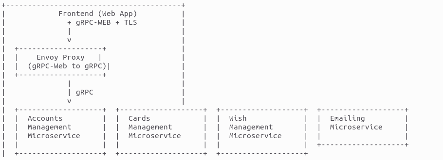

# Virtual Credit Card Generator

## Overview

In a time when Lebanon is facing an economic crisis, the need for accessible and affordable online payment solutions is more crucial than ever. The "Virtual Credit Card Generator" project aims to address this need by providing a service that allows users in Lebanon to obtain virtual credit cards with ease and minimal fees.

## How It Works

The "Virtual Credit Card Generator" project streamlines the process of obtaining virtual credit cards for users in Lebanon, offering a straightforward and cost-effective solution during economic crises. Here's a step-by-step overview of how our system operates:

1. **User Registration**:
   - Users must first register for an account on our platform. During registration, they provide necessary personal information.

2. **Wish Receipt Requirement**:
   - To use the virtual credit card generation service, users are required to have a valid Wish money transfer receipt.
   - This receipt serves as proof of funds and initiates the process.

3. **Uploading Wish Receipt**:
   - Once registered, users can log in to their accounts and upload their Wish money transfer receipts.
   - Our system verifies the receipt's details, including the transferred amount.

4. **Account Verification**:
   - User accounts undergo verification to ensure compliance with security and legal standards.
   - This verification step helps prevent misuse of our service.

5. **Credit Card Generation**:
   - Upon successful verification and validation of the Wish receipt, our system generates a virtual credit card with the corresponding amount.
   - Users can specify the desired expiration date for the virtual credit card.

6. **Email Confirmation**:
   - Users receive an email confirmation with details of their newly generated virtual credit card.

7. **Management Dashboard**:
   - Users have access to a management dashboard where they can view their virtual credit cards, transaction history, and manage their account.

8. **Low Fees and Accessibility**:
   - Our service is designed to be cost-effective, minimizing fees compared to traditional banking solutions.
   - It provides accessibility to online payment methods even in challenging economic conditions.
   - 
## Fee Calculation

To calculate the fee that the user needs to pay when requesting a virtual credit card, we will use the actual exchange rate. As of the current date, the actual rates are:

- 1 USD = 0.955197 EUR
- 1 EUR = 1.046904461 USD

Here's how the fee calculation works using these actual rates:

1. **User Request**: The user enters the desired amount in dollars ($USD) that they want on the virtual credit card.

2. **Fixed Fee**: Add the fixed fee of 2 euros (EUR) to the user's requested dollar amount.

3. **Total Amount in Euros**: Calculate the equivalent amount in euros (EUR) for the user's total request, including the fixed fee.

    Total in EUR = (User's Request in USD + 2 EUR) * 0.955197 EUR/USD

4. **Total Amount in Dollars**: If needed, you can convert the total amount in euros back to dollars using the provided exchange rate of 1 EUR = 1.046904461 USD:

    Total in USD = Total in EUR * 1.046904461 USD/EUR

5. **Payment Request**: Present the user with the total amount they need to pay in dollars ($USD), including the fixed fee.

For example, if the user wants to load 100 USD onto the virtual credit card:

- Add the fixed fee: 100 USD + 2 EUR = 100 USD + 1.911394 EUR (2 EUR / 0.955197 EUR/USD) = 101.911394 EUR

- If needed, convert the total back to dollars: 101.911394 EUR * 1.046904461 USD/EUR = 106.83 USD

So, the user would need to pay approximately 106.83 USD to cover the cost of generating the virtual credit card with 100 USD worth of euros, including the fixed fee of 2 euros.

Please ensure that your system always uses the most up-to-date exchange rates to provide users with accurate payment information.

## Backend Architecture

The backend of the "Virtual Credit Card Generator" will be developed in Golang as microservices that communicate via gRPC with the Frontend via envoy proxy,the traffic will be TLS encrypted from the front to the proxy. The backend microservices themselves can communicate with third-party APIs via HTTPS. The backend will be divided into the following microservices:

- **Accounts Management Microservice**:
  - Responsible for user authentication, registration, password recovery, and account deletion.

- **Cards Management Microservice**:
  - Communicates with a web France Fortuneo account in order to generate the virtual credit cards.

- **Wish Management Microservice**:
  - Processes the Wish transfers receipt and deposits the money into the Wish account.

- **Emailing Microservice**:
  - Handles email notifications and communication with users.

Each microservice can have its own SQL database schema within a single PostgreSQL database for the platform, ensuring modularity and scalability.

## Project Requirements

To realize our project, we require the following technical components:

1. **OVH Ubuntu Machine**:
   - OVH virtual private server (VPS) or dedicated machine running Ubuntu.
   - Public IP address and SSH access for remote administration.

2. **Gandi Domain Name**:
   - Domain name registered through Gandi or another registrar.
   - DNS settings configured to point to the OVH server's public IP.

3. **SSL Trusted Certificate**:
   - SSL certificate obtained from a trusted certificate authority (CA).
   - Installation and configuration on our OVH server for HTTPS.

4. **Third-Party Email Service Provider**:
   - Utilization of a third-party email service provider for reliable email communication.

5. **Programming**:
   - Backend development in Golang as microservices with gRPC communication.
   - PostgreSQL database for the platform.

By combining these technical components with the Wish receipt requirement, the "Virtual Credit Card Generator" project aims to offer an accessible, secure, and affordable financial solution for users in Lebanon, particularly during challenging economic times.

